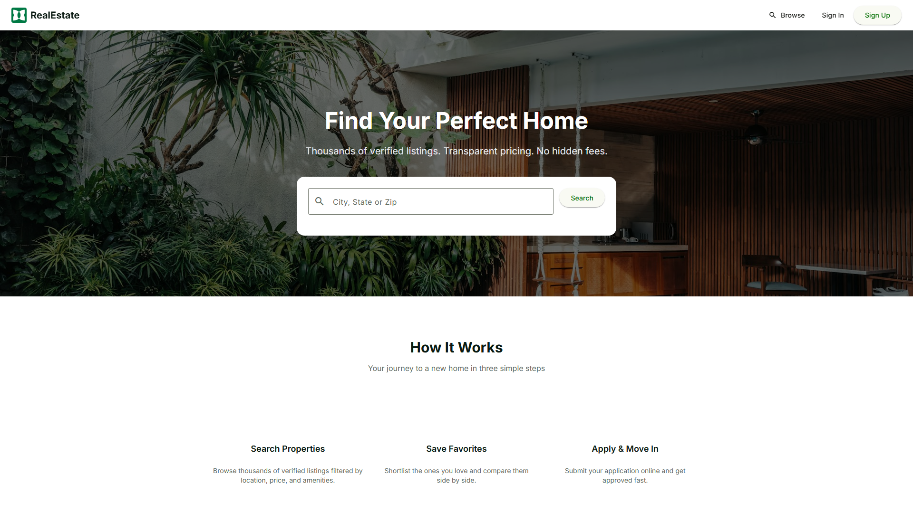
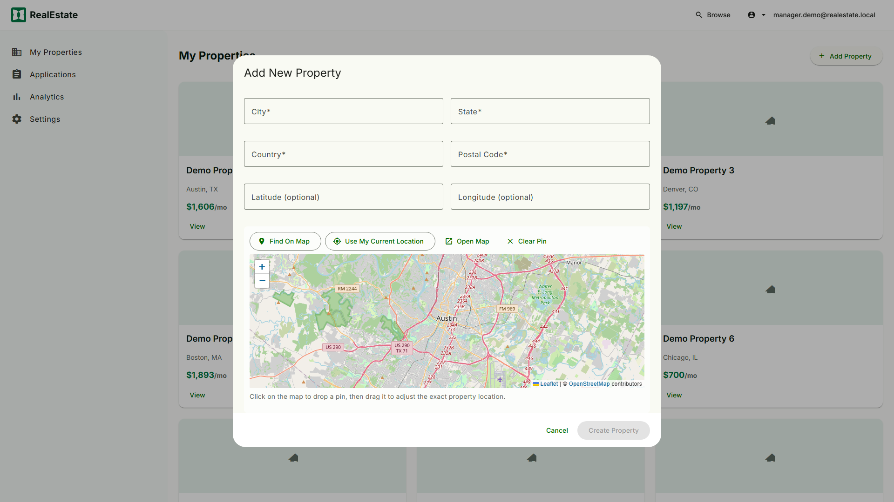
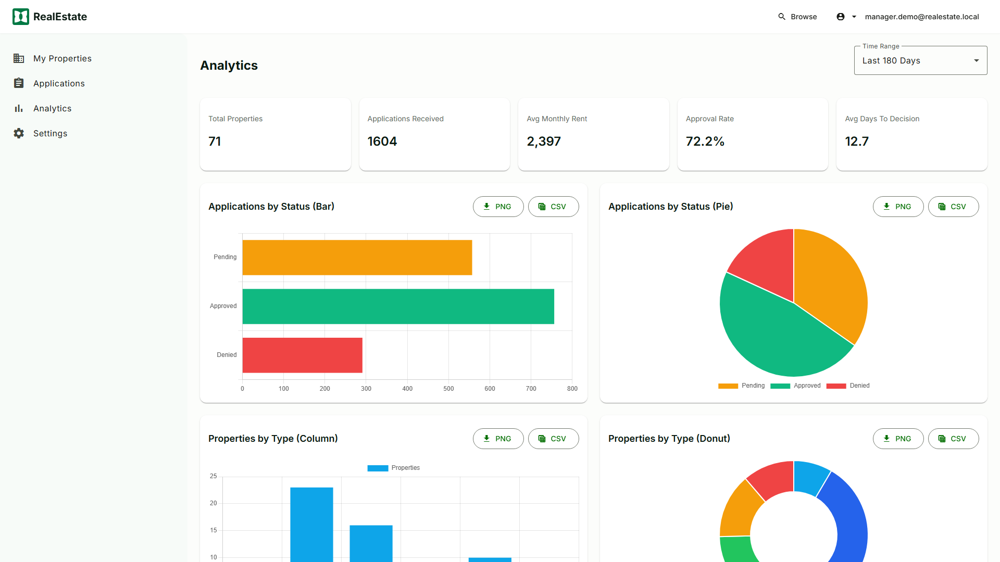

# RealEstatePro

RealEstatePro is a full-stack real estate management application designed to handle property listings, tenant applications, and managerial dashboards. It leverages a modern architecture with a responsive frontend and a robust backend API.

## 🌍 Live Demo
You can view the fully functional production deployment of this application here:
**[http://app.169.58.26.183.sslip.io](http://app.169.58.26.183.sslip.io)**

### 🔑 Demo Credentials
To experience the full power of the platform without creating an account, use the pre-seeded demo accounts:

**Manager Account** (Full Access to Maps & Analytics)
- **Email:** `manager.demo@realestate.local`
- **Password:** `DemoManager123!`

**Tenant Account** (Browse & Apply)
- **Email:** `tenant.demo1@realestate.local`
- **Password:** `DemoTenant123!`

### 🗺️ Experiencing Maps & Analytics
To unlock the full potential of RealEstatePro:
1. Log in using the **Manager Account** credentials above.
2. Click on **Dashboard** in the top navigation bar.
3. Explore the **Analytics Tab** to see real-time, interactive charts displaying revenue streams, occupancy rates, and application velocity across all 180 seeded properties.
4. Click on **Properties**, then click **Add Property**. You will see a fully interactive **Leaflet** map integration! You can click anywhere on the map to drop a pin and instantly capture the exact latitude and longitude coordinates for new property listings.

## 🚀 Technology Stack

- **Frontend:** Angular & Vite, styled with Tailwind CSS / custom modern aesthetics.
- **Backend:** ASP.NET Core 10 Web API.
- **Databases:** PostgreSQL (for Property and Location data) and Microsoft SQL Server (for Authentication, Tenants, and Identity).
- **ORM:** Entity Framework Core.
- **Infrastructure:** Docker Compose for local database spin-up.

---

## 🛠️ Prerequisites

To run this project locally, ensure you have the following installed:
- [Docker Desktop](https://www.docker.com/products/docker-desktop/) (Required to run the databases)
- [.NET 10.0 SDK](https://dotnet.microsoft.com/download)
- [Node.js (v18+)](https://nodejs.org/) & npm

---

## 🏃‍♂️ Getting Started

Follow these step-by-step instructions to get the application running on your local machine.

### 1. Start the Databases
The project relies on two databases. We use Docker to spin them up effortlessly.
Open a terminal in the root directory and run:
```bash
docker compose up -d
```
*This starts a PostgreSQL instance on port `5432` and a SQL Server instance on port `1433`.*

### 2. Setup the Backend API
The backend requires some initial setup to restore dependencies and apply database schemas.
Navigate to the `backend` folder:
```bash
cd backend
```
Restore NuGet packages:
```bash
dotnet restore
```
Apply Entity Framework Migrations to build the database schemas:
```bash
dotnet ef database update --context PropertyDbContext
dotnet ef database update --context PeopleDbContext
```

**Start the Server:**
Run the backend server (ensure your environment is set to Development):
```bash
# On Windows (PowerShell):
$env:ASPNETCORE_ENVIRONMENT="Development"
dotnet run

# On Mac/Linux:
ASPNETCORE_ENVIRONMENT=Development dotnet run
```
*The API will start at `http://localhost:5000`. Test it by navigating to `http://localhost:5000/api/properties`.*

### 3. Setup the Frontend
Open a new terminal window and navigate to the `frontend` (or root) folder depending on your setup. If the `package.json` is in the root, run it there:
```bash
npm install
npm start
```
*The application will compile and become accessible at `http://localhost:4200`.*

## 📸 Features & Screenshots

Here is a glimpse into the active run of the RealEstatePro application:

### Home & Discover
The landing page provides a beautiful and welcoming entry point.


### Location Selector Map
Managers can visually pinpoint property locations using the integrated interactive map.


### Manager Analytics Dashboard
Property managers have access to deep analytics portraying application velocity, revenue, and occupancy rates.


---

## 📄 License
MIT License.
